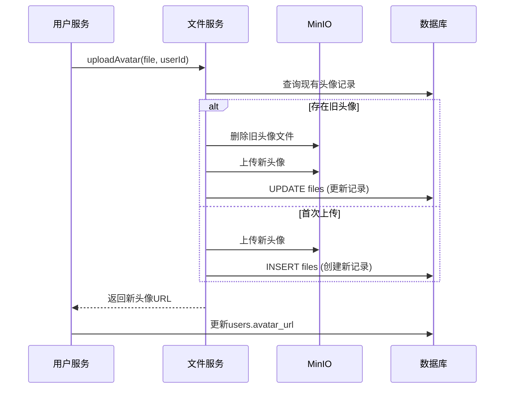

# 头像上传功能说明

## 📋 功能概述

用户头像上传功能支持头像覆盖更新，确保每个用户在数据库中只保留一条头像记录，同时自动清理MinIO中的旧头像文件。

## 🔄 核心特性

### 1. 头像覆盖更新
- ✅ 一个用户只保留**一条头像记录**（通过数据库唯一索引保证）
- ✅ 上传新头像时，自动**删除MinIO中的旧文件**
- ✅ 更新数据库记录（ID保持不变，只更新文件信息和时间戳）
- ✅ 同步更新用户表的 `avatar_url` 字段

### 2. 权限控制
- ✅ 用户只能上传自己的头像（通过Sa-Token验证）
- ✅ 需要登录才能上传（Sa-Token拦截器）

### 3. 文件验证
- ✅ 仅支持图片格式（image/*）
- ✅ 文件大小限制：最大2MB（可在配置中调整）

## 📊 数据库设计

### files表结构（头像相关字段）

| 字段名 | 类型 | 说明 |
|--------|------|------|
| id | BIGINT | 主键，自增 |
| user_id | BIGINT | 用户ID（外键） |
| file_category | VARCHAR(50) | 文件分类（头像固定为'AVATAR'） |
| file_name | VARCHAR(255) | MinIO存储的文件名 |
| file_path | VARCHAR(500) | MinIO文件路径 |
| file_url | VARCHAR(500) | 文件访问URL |
| updated_at | DATETIME | 最后更新时间 |
| deleted | TINYINT | 软删除标记 |

### 唯一索引

```sql
-- 确保一个用户只有一个头像记录
UNIQUE INDEX uk_user_avatar (user_id, file_category, deleted)
```

## 🔧 实现逻辑

### 上传流程



### 核心代码

**文件服务 - 头像上传**：
```java
@Override
public String uploadAvatar(MultipartFile file, Long userId) {
    // 1. 查询现有头像
    FileInfo existingAvatar = fileMapper.selectOne(
        new LambdaQueryWrapper<FileInfo>()
            .eq(FileInfo::getUserId, userId)
            .eq(FileInfo::getFileCategory, "AVATAR")
    );

    // 2. 删除MinIO中的旧文件
    if (existingAvatar != null) {
        minioClient.removeObject(...);
    }

    // 3. 上传新文件到MinIO
    minioClient.putObject(...);

    // 4. 更新或插入数据库
    if (existingAvatar != null) {
        // 更新现有记录
        existingAvatar.setFileUrl(newUrl);
        existingAvatar.setUpdatedAt(LocalDateTime.now());
        fileMapper.updateById(existingAvatar);
    } else {
        // 插入新记录
        fileMapper.insert(newAvatar);
    }

    return fileUrl;
}
```

## 🚀 使用方法

### 1. API调用

**接口地址**：`POST /user/avatar/upload`

**请求头**：
```http
Authorization: your_sa_token_here
Content-Type: multipart/form-data
```

**请求参数**：
| 参数名 | 类型 | 必填 | 说明 |
|--------|------|------|------|
| file | File | 是 | 头像文件（图片） |

**响应示例**：
```json
{
  "code": 200,
  "message": "头像上传成功",
  "data": "http://192.168.200.130:9000/public-bucket/avatars/2025-10-30/xxx.png",
  "timestamp": 1698765432100
}
```

### 2. Swagger UI测试

1. 访问：`http://localhost:8001/swagger-ui.html`
2. 找到 `用户管理` -> `上传头像`
3. 点击 **Authorize** 按钮，输入Token
4. 点击 `Try it out`
5. 选择图片文件
6. 点击 `Execute`

### 3. cURL示例

```bash
curl -X POST "http://localhost:8001/user/avatar/upload" \
  -H "Authorization: your_token_here" \
  -H "Content-Type: multipart/form-data" \
  -F "file=@/path/to/avatar.png"
```

## 📁 文件存储

### MinIO存储路径规则

```
public-bucket/
└── avatars/
    └── 2025-10-30/              # 日期目录
        ├── abc123xxx.png        # UUID文件名
        └── def456xxx.jpg
```

### 文件命名规则
- **格式**：`{UUID}.{扩展名}`
- **示例**：`95fd817bd710422b8d856a2a6994e547.png`

## ⚙️ 配置说明

### 文件大小限制（application.yml）

```yaml
spring:
  servlet:
    multipart:
      enabled: true
      max-file-size: 2MB        # 单个文件最大2MB
      max-request-size: 2MB     # 请求最大2MB
```

### MinIO配置

```yaml
minio:
  endpoint: http://192.168.200.130:9000
  access-key: admin
  secret-key: admin123
  bucket-name: public-bucket
```

## 🔍 数据库查询示例

### 查看用户头像记录

```sql
SELECT 
    id,
    user_id,
    file_name,
    file_url,
    file_size,
    updated_at
FROM files
WHERE user_id = 1 
  AND file_category = 'AVATAR'
  AND deleted = 0;
```

### 查看重复头像记录（用于排查）

```sql
SELECT 
    user_id, 
    COUNT(*) as count 
FROM files 
WHERE file_category = 'AVATAR' 
  AND deleted = 0
GROUP BY user_id 
HAVING count > 1;
```

## 🐛 常见问题

### Q1: 上传头像后，旧头像还能访问吗？
**A**: 不能。旧头像文件已从MinIO中删除，访问会返回404。

### Q2: 如果删除MinIO文件失败怎么办？
**A**: 系统会记录警告日志，但会继续上传新头像。建议定期清理MinIO中的孤立文件。

### Q3: 数据库中会有多条头像记录吗？
**A**: 不会。通过唯一索引 `uk_user_avatar` 保证一个用户只有一条AVATAR记录。

### Q4: 头像URL会变化吗？
**A**: 会。每次上传都会生成新的UUID文件名和新的URL。

## 📝 日志示例

### 首次上传
```
INFO  - 创建头像记录成功: userId=1, fileId=1, fileUrl=http://192.168.200.130:9000/...
INFO  - 用户头像上传成功: userId=1, avatarUrl=http://192.168.200.130:9000/...
```

### 覆盖上传
```
INFO  - 删除旧头像文件成功: userId=1, oldFilePath=avatars/2025-10-30/old.png
INFO  - 更新头像记录成功: userId=1, fileId=1, fileUrl=http://192.168.200.130:9000/...
INFO  - 用户头像上传成功: userId=1, avatarUrl=http://192.168.200.130:9000/...
```

## 🔗 相关文档

- [用户信息更新和头像上传说明](./用户信息更新和头像上传说明.md)
- [API文档说明](./API文档说明.md)
- [Sa-Token使用说明](./认证功能使用说明.md)

## 🛠️ 维护建议

1. **定期清理孤立文件**：检查MinIO中存在但数据库中无记录的文件
2. **监控存储空间**：关注MinIO和数据库的存储使用情况
3. **日志审计**：定期检查上传日志，排查异常操作
4. **备份策略**：定期备份MinIO和数据库数据


